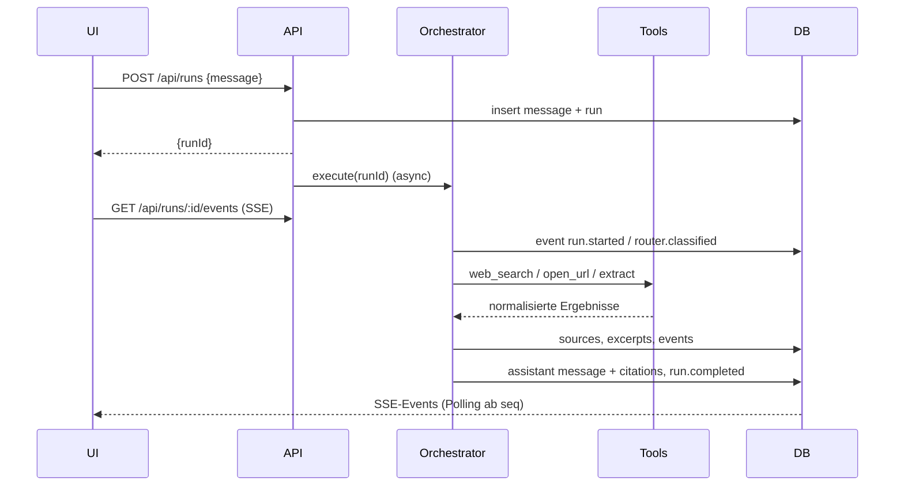

# Architecture Overview

## Purpose
Legt Schichten, Modulgrenzen und den Datenfluss einer Anfrage fest, damit Agentenlogik testbar,
austauschbar und vom Framework unabhängig bleibt.

## Scope / Out of Scope
In Scope: Verzeichnisstruktur, Schichtenregeln, Ablauf einer Anfrage.
Out of Scope: Einzelne Feature-Abläufe (jeweilige Feature-Spec).

## User Story
„Als implementierender Agent möchte ich wissen, in welche Schicht ein Stück Logik gehört und was es
importieren darf."

## Functional Requirements
- `FR-02-01` Agentenlogik MUSS ausschließlich serverseitig unter `lib/` liegen; `components/` enthält keine Modell- oder Tool-Aufrufe.
- `FR-02-02` `lib/agent`, `lib/tools`, `lib/llm`, `lib/search` DÜRFEN keine Next.js-Module importieren.
- `FR-02-03` Zugriff auf die Datenbank NUR über `lib/db/repositories/*`.
- `FR-02-04` Externe Anbieter NUR hinter den Interfaces `LLMProvider`, `SearchProvider`, `ToolDefinition`.
- `FR-02-05` Jede Schicht MUSS ohne die darüberliegende testbar sein.

## Expected Behavior
```
components/ (Client, rein darstellend)
        ↓ fetch / EventSource
app/api/* (Validierung, Auth-Hook, Rate Limit, Serialisierung)
        ↓
lib/agent/orchestrator (Run-Lebenszyklus, Router, Planner, Loop)
        ↓                    ↘
lib/llm (Provider)      lib/tools (Registry, Guards)
                              ↓
                        lib/search, lib/fetch (Web)
        ↓
lib/db/repositories → SQLite
```
Verzeichnisse:
```
app/            Routen und Route Handler
components/     React-Komponenten (Client)
lib/agent/      router, planner, orchestrator, state, research/
lib/llm/        provider.ts, openai.ts, openai-compatible.ts, catalog.ts
lib/search/     provider.ts, providers.ts (OpenAI, Brave, Tavily)
lib/tools/      registry.ts, web-search.ts, open-url.ts, extract.ts, utilities.ts
lib/db/         client.ts, migrate.ts, migrations/, repositories/
lib/contracts/  domain.ts, events.ts, errors.ts, schemas.ts
lib/config/     env.ts
lib/util/       id, logger, tokens, truncate, url-safety, html
tests/          unit/, integration/, smoke/, doubles/ (Test-Doubles, Stub-Server)
specs/          diese Spezifikationen
```

## User Flow
Nicht zutreffend.

## System Flow
1. `POST /api/runs` validiert die Eingabe, legt `user`-Message und `run` an, startet `orchestrator.execute()`
   asynchron und antwortet mit `{ runId, conversationId, messageId }`.
2. Der Orchestrator emittiert Events in `run_events` und aktualisiert den Run-State nach jedem Schritt.
3. Der Client öffnet `GET /api/runs/:id/events` (SSE) und rendert Trace und Antwort-Deltas.
4. Am Ende schreibt der Orchestrator die Assistant-Message inkl. Citations und emittiert `run.completed`.



## Agent Behavior
Der Orchestrator ist die einzige Stelle, die Events emittiert und Statuswechsel vornimmt.

## Contracts
Siehe Spec 05.

## API Requirements
Siehe Spec 08.

## Data Model
Siehe Spec 04.

## UI Requirements
Siehe Spec 10.

## States
Nicht zutreffend — Begründung: Statusmodell in Spec 17.

## Telemetry & Events
Jede Schicht loggt strukturiert mit `run_id` als Korrelations-ID (Spec 40).

## Configuration
Siehe Spec 43.

## Edge Cases
1. Client bricht SSE ab → Run läuft weiter, Events bleiben persistiert.
2. Prozessneustart während eines Runs → Run bleibt `running` und wird beim Laden als `failed` mit
   Teilergebnis dargestellt (Spec 17).
3. Zwei parallele Runs derselben Conversation → erlaubt, aber UI zeigt nur den neuesten aktiv an.
4. Tool wirft synchron → Guard fängt ab, `tool.call.failed`, Run läuft weiter.

## Error Handling
Fehler werden in der Schicht behandelt, in der sie auftreten, und als Envelope nach oben gereicht (Spec 38).

## Security Considerations
Keine Secrets im Client-Bundle; alle `process.env`-Zugriffe nur in `lib/config/env.ts` (serverseitig).

## Performance Budget
Route-Handler-Overhead ≤ 50 ms ohne Modellaufruf; SSE-Latenz ≤ 200 ms nach Event-Persistenz.

## Test Plan
Ein Architekturtest prüft per Import-Scan, dass `lib/agent|tools|llm|search` keine `next/*`- und keine
`components/*`-Importe enthalten.

## Acceptance Criteria
- `AC-02-01` Given `lib/`, When der Architekturtest läuft, Then existieren keine verbotenen Importe. (FR-02-01, FR-02-02)
- `AC-02-02` Given ein Orchestrator-Test ohne HTTP-Server, When ein Run ausgeführt wird, Then läuft er vollständig durch. (FR-02-05)

## Definition of Done
Architekturtest grün, Verzeichnisstruktur angelegt.

## Dependencies
01, 03.

## Implementation Notes
Route Handler bleiben dünn: validieren, delegieren, serialisieren.

## Open Decisions
Keine.
