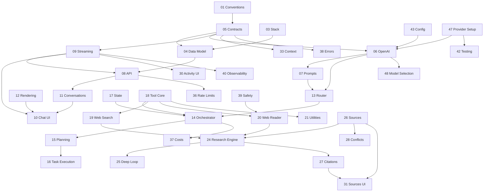

# Spec-Index — Insight Agent (Autonomer AI Research Agent)

Stand: 2026-09-01 · Specs sind die verbindliche Wahrheit für die Implementierung.

Weitere Dokumente: [DECISIONS.md](DECISIONS.md) (ADRs) · [OPEN-QUESTIONS.md](OPEN-QUESTIONS.md) ·
[CONSISTENCY-REPORT.md](CONSISTENCY-REPORT.md) (automatische Prüfung) ·
[../IMPLEMENTATION-LOG.md](../IMPLEMENTATION-LOG.md) (Umsetzungsprotokoll).

**Umsetzungsstand:** alle 38 MVP-Specs implementiert und verifiziert; V1/V2-Specs sind Kurzform-Entwürfe.

## Abweichungen von der Baseline-Liste (begründet)

| Abweichung | Begründung |
|---|---|
| `21-tool-utilities` fasst Calculator + Date/Time zusammen | Beide sind triviale, zustandslose Tools; getrennte Specs erzeugten reine Duplikate. |
| V1/V2-Specs in Kurzform (Purpose, Scope, FR, AC, Dependencies, Notes) | Vollformat ohne Implementierungsabsicht erzeugt Scheingenauigkeit, die später korrigiert werden muss. MVP-Specs sind im Vollformat. |
| Persistenz: SQLite (`node:sqlite`) statt Postgres/Drizzle im MVP | Siehe ADR-002. Repository-Interface hält Postgres offen. |
| `47-provider-setup.md` ersetzt den früheren Demo-Modus | Simulierte Antworten wurden entfernt (ADR-013). |
| Zusätzlich: `48-model-selection.md` | Nutzer wählen das Modell selbst (ADR-012, Spec 48). |

## Alle Specs

| ID | Titel | Milestone | Phase | Beschreibung |
|---|---|---|---|---|
| 00 | Product Overview | MVP | 1 | Produktziel, Nutzerversprechen, Nicht-Ziele, Referenzszenarien, MVP-Definition. |
| 01 | Glossary & Conventions | MVP | 1 | Verbindliche Begriffe (run, step, source, excerpt, claim), Namens-, Zeit-, ID- und Geldkonventionen. |
| 02 | Architecture Overview | MVP | 1 | Schichtenmodell, Modulgrenzen, Datenfluss einer Anfrage, Regeln zur Erweiterbarkeit. |
| 03 | Tech Stack & Decisions | MVP | 1 | Gewählter Stack mit Begründung; Verweis auf DECISIONS.md (ADRs). |
| 04 | Data Model & Database | MVP | 1 | Alle Tabellen, Felder, Indizes, Migrationen, Repository-Schnittstelle. |
| 05 | Shared Contracts | MVP | 1 | Single Source of Truth: Domain-Typen, Zod-Schemas, Event-Union, Fehlercodes. |
| 06 | OpenAI Integration | MVP | 1 | LLMProvider-Abstraktion, Responses API, Structured Outputs, Streaming, Retries, Kostenerfassung. |
| 07 | Prompt Management | MVP | 1 | Zentrale, versionierte Prompt-Bausteine; Trennung Instruktion/Daten. |
| 08 | API Surface | MVP | 2 | Alle Endpunkte mit Request-/Response-/Fehler-Payloads. |
| 09 | Streaming Protocol | MVP | 2 | SSE-Transport, Event-Envelope, Event-Typen, Resume, Persistenz, Replay. |
| 10 | Chat Interface | MVP | 2 | Chat-UI, Composer, Streaming-Darstellung, Stop/Retry, Shortcuts, Responsive. |
| 11 | Conversation Management | MVP | 2 | Anlegen, Auflisten, Auto-Titel, Umbenennen, Löschen, History-Laden. |
| 12 | Message Rendering | MVP | 2 | Sanitisiertes Markdown, Codeblöcke, Tabellen, Inline-Citations. |
| 13 | Agent Request Router | MVP | 3 | Klassifikation der Anfrage, Confidence-Regeln, Tool-Allowlist und Budget je Typ. |
| 14 | Agent Orchestrator | MVP | 3 | Run-Lebenszyklus, Pfadauswahl, Eskalation, Abbruch, Event-Emission. |
| 15 | Agent Planning | MVP | 3 | Erzeugung und Aktualisierung des Rechercheplans (Teilfragen, Schritte, Abhängigkeiten). |
| 16 | Task Execution | MVP | 3 | Schrittausführung, Parallelität, Replanning-Grenzen, Teilergebnisse. |
| 17 | Agent State Management | MVP | 3 | Persistenter Run-State, Statusübergänge, Abbruch, Wiederaufnahme-Semantik. |
| 18 | Tool System Core | MVP | 3 | Registry, Tool-Definition, Ausführung, Guards, Normalisierung, Fehlerklassen. |
| 19 | Web Search Tool | MVP | 4 | SearchProvider-Abstraktion, Query-Generierung, Ergebnis-Normalisierung, Dedup. |
| 20 | Web Content Reader | MVP | 4 | Sicheres Abrufen und Extrahieren von Seiteninhalten inkl. SSRF-Guard. |
| 21 | Tool Utilities | MVP | 4 | Calculator und Date/Time als deterministische Hilfstools. |
| 22 | File Search & Retrieval | MVP | 4 | Embeddings/Vector Store für Prompts, generierte Daten & Dokumentenrecherche. |
| 23 | Code Execution Tool | V2 | 7 | Sandboxed Python/JS-Ausführung für Datenanalyse. |
| 24 | Research Engine | MVP | 4 | Orchestrierung einer Recherche: Suche → Auswahl → Lesen → Extraktion → Synthese. |
| 25 | Deep Research Loop | MVP | 4 | Iterative Nachrecherche, Sättigungserkennung, Budgets, Abbruchbedingungen. |
| 26 | Source Management | MVP | 4 | Quellenmodell, Dedup, Trust-Ranking, Excerpts, Persistenz. |
| 27 | Citation System | MVP | 4 | Claim→Source-Zuordnung, Marker-Rendering, Verifikation gegen Halluzinationen. |
| 28 | Conflict Detection | MVP | 4 | Erkennung widersprüchlicher Werte und deren transparente Darstellung. |
| 29 | Report Generation | V1 | 7 | Langform-Berichte mit Gliederung, Tabellen und Quellenverzeichnis. |
| 30 | Agent Activity UI | MVP | 5 | Live-Execution-Trace, Statusanzeige, Tool-Call-Visualisierung. |
| 31 | Sources Panel UI | MVP | 5 | Quellenliste, Detailansicht, Sprung von Citation zu Quelle. |
| 32 | File Upload & Documents | V2 | 7 | Upload, Parsing und Analyse von PDF/DOCX/TXT. |
| 33 | Context & Memory Management | MVP | 5 | Token-Budgetierung, Kürzung, Follow-up-Kontext aus vorheriger Recherche. |
| 34 | Authentication | V1 | 8 | Login, Sessions, Feature-Flag für Single-User-Betrieb. |
| 35 | Authorization & Ownership | V1 | 8 | Zugriffsprüfung auf Conversations, Runs und Quellen. |
| 36 | Rate Limiting & Quotas | MVP | 6 | Limits pro Nutzer, Route und Zieldomain. |
| 37 | Cost Tracking & Budgets | MVP | 6 | Token-/Kostenerfassung je Run, Hardstop, Warn-Events. |
| 38 | Error Handling & Resilience | MVP | 6 | Fehler-Envelope, Retry/Backoff, Fallbacks, Teilergebnisse. |
| 39 | Prompt Injection & Content Safety | MVP | 6 | Untrusted-Content-Regime, SSRF, Sanitizing, Exfiltrationsschutz. |
| 40 | Observability & Tracing | MVP | 6 | Strukturierte Logs, Run-Trace, Metriken, Debug-Ansicht. |
| 41 | Evaluation Harness | V1 | 7 | Golden-Set, Bewertung von Citation-Abdeckung und Antwortqualität. |
| 42 | Testing Strategy | MVP | 6 | Testarten, Fixtures, LLM-Ersatz, Coverage-Erwartung, CI-Gates. |
| 43 | Configuration & Environments | MVP | 1 | Env-Variablen, Validierung beim Start, Feature-Flags, Defaults. |
| 44 | Deployment & CI | V1 | 8 | Build, Migrationen, Healthcheck, CI-Pipeline, Vercel/Docker. |
| 45 | Background Jobs & Durability | V1 | 8 | Fortsetzbare Runs, Worker, Wiederaufnahme nach Neustart. |
| 46 | Export & Sharing | V2 | 8 | Export als Markdown/PDF, teilbare Read-only-Links. |
| 47 | Provider Setup | MVP | 1 | Auflösung des LLM-/Suchanbieters und Verhalten ohne Konfiguration. |
| 48 | Model Selection | MVP | 5 | Modellkatalog des Anbieters und Modellwahl je Run. |

## Abhängigkeitsgraph (zyklenfrei)

Validierung: Der Graph enthält keine Zyklen (topologische Sortierung entspricht der Phasenreihenfolge unten).

## Implementierungsreihenfolge

| Phase | Specs | Zwischenergebnis |
|---|---|---|
| 1 Foundation | 01, 03, 43, 05, 04, 47, 06, 07, 02 | App startet, DB migriert, LLM-Provider (real + fixture) testbar |
| 2 Basic Chat | 09, 08, 11, 12, 10 | Benutzbarer Chat mit Streaming und persistenter History |
| 3 Agent Core | 18, 17, 13, 14, 15, 16, 21 | Agent klassifiziert, plant und ruft Tools auf |
| 4 Research | 19, 20, 26, 24, 25, 27, 28 | Echte Web-Recherche mit Quellen und Citations |
| 5 Agent UX | 30, 31, 33, 48 | **MVP vollständig** |
| 6 Härtung | 38, 39, 36, 37, 40, 42 | Produktionsnahe Robustheit |
| 7 Erweiterungen | 22, 23, 29, 32, 41 | V1/V2-Funktionen |
| 8 Produktion | 34, 35, 45, 44, 46 | Mehrbenutzerbetrieb und Deployment |

Sicherheitsanteile aus 39 werden **mit** den Specs 19/20 umgesetzt, nicht nachgelagert.

## MVP-Abnahme (Produktebene)

1. Chatten · 2. normale Fragen ohne Research-Overhead · 3. Research-Auftrag · 4. Live-Fortschritt ·
5. echte Websuche · 6. mehrere Quellen · 7. rückverfolgbare Citations · 8. Follow-ups mit Kontext ·
9. Abbruch eines laufenden Runs · 10. Conversations wiederfinden.
